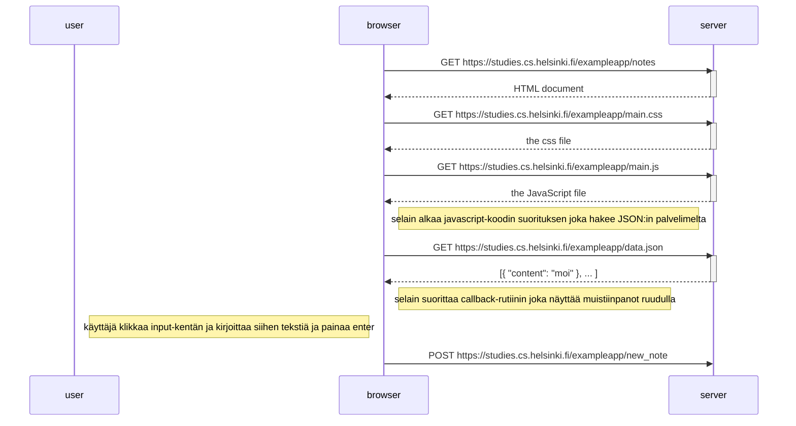

```mermaid
sequenceDiagram
    participant user
    participant browser
    participant server
    
    browser->>server: GET https://studies.cs.helsinki.fi/exampleapp/notes
    activate server
    server-->>browser: HTML document
    deactivate server

    browser->>server: GET https://studies.cs.helsinki.fi/exampleapp/main.css
    activate server
    server-->>browser: the css file
    deactivate server

    browser->>server: GET https://studies.cs.helsinki.fi/exampleapp/main.js
    activate server
    server-->>browser: the JavaScript file
    deactivate server

    Note right of browser: selain alkaa  javascript-koodin suorituksen joka hakee JSON:in palvelimelta

    browser->>server: GET https://studies.cs.helsinki.fi/exampleapp/data.json
    activate server
    server-->>browser: [{ "content": "moi" }, ... ]
    deactivate server

    Note right of browser: selain suorittaa callback-rutiinin joka näyttää muistiinpanot ruudulla

    Note right of user: käyttäjä klikkaa input-kentän ja kirjoittaa siihen tekstiä ja painaa enter

    browser->>server: POST https://studies.cs.helsinki.fi/exampleapp/new_note


```
