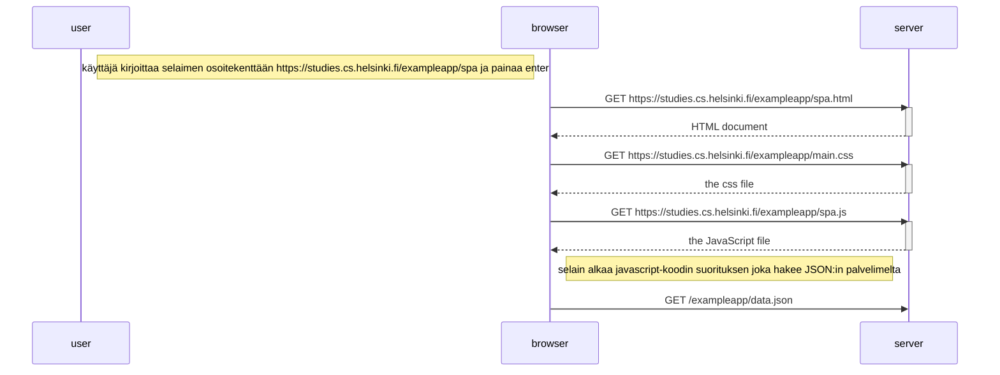

```mermaid
sequenceDiagram
    participant user
    participant browser
    participant server

    Note right of user: käyttäjä kirjoittaa selaimen osoitekenttään https://studies.cs.helsinki.fi/exampleapp/spa ja painaa enter
    
    browser->>server: GET https://studies.cs.helsinki.fi/exampleapp/spa.html
    activate server
    server-->>browser: HTML document
    deactivate server

    browser->>server: GET https://studies.cs.helsinki.fi/exampleapp/main.css
    activate server
    server-->>browser: the css file
    deactivate server

    browser->>server: GET https://studies.cs.helsinki.fi/exampleapp/spa.js
    activate server
    server-->>browser: the JavaScript file
    deactivate server

    Note right of browser: selain alkaa  javascript-koodin suorituksen joka hakee JSON:in palvelimelta
    browser->>server: GET /exampleapp/data.json

```
