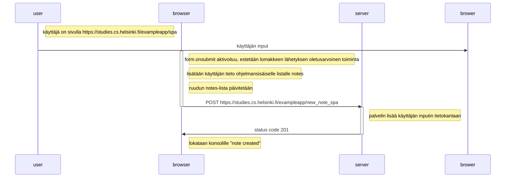

```mermaid
sequenceDiagram
    participant user
    participant browser
    participant server

    Note right of user: käyttäjä on sivulla https://studies.cs.helsinki.fi/exampleapp/spa
    user->>brower: käyttäjän input

    activate browser
    Note right of browser: form.onsubmit aktivoituu, estetään lomakkeen lähetyksen oletusarvoinen toiminta
    Note right of browser: lisätään käyttäjän tieto ohjelmansisäiselle listalle notes
    Note right of browser: ruudun notes-lista päivitetään
    browser->>server: POST https://studies.cs.helsinki.fi/exampleapp/new_note_spa
    deactivate browser

    activate server
    Note right of server: palvelin lisää käyttäjän inputin tietokantaan
    server->>browser: status code 201
    deactivate server

    Note right of browser: lokataan konsolille "note created"


```
