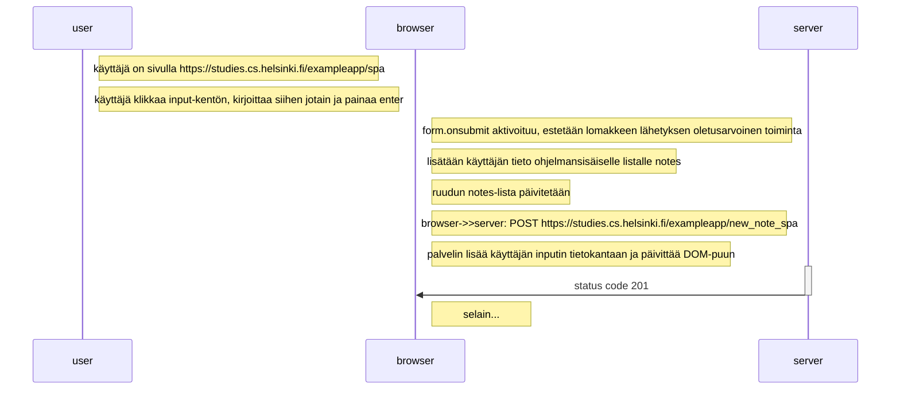

```mermaid
sequenceDiagram
    participant user
    participant browser
    participant server

    Note right of user: käyttäjä on sivulla https://studies.cs.helsinki.fi/exampleapp/spa
    Note right of user: käyttäjä klikkaa input-kentön, kirjoittaa siihen jotain ja painaa enter
    
    Note right of browser: form.onsubmit aktivoituu, estetään lomakkeen lähetyksen oletusarvoinen toiminta
    Note right of browser: lisätään käyttäjän tieto ohjelmansisäiselle listalle notes
    Note right of browser: ruudun notes-lista päivitetään
    Note right of browser: browser->>server: POST https://studies.cs.helsinki.fi/exampleapp/new_note_spa

    Note right of browser: palvelin lisää käyttäjän inputin tietokantaan ja päivittää DOM-puun

    activate server
    server->>browser: status code 201
    deactivate server

    Note right of browser: selain...


```
