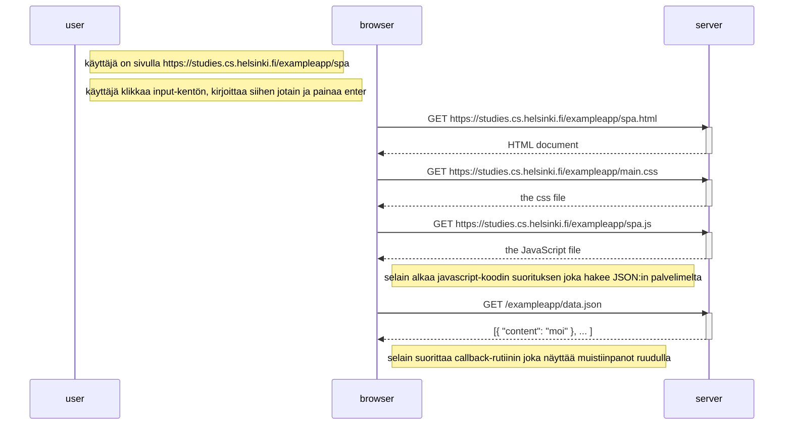

```mermaid
sequenceDiagram
    participant user
    participant browser
    participant server

    Note right of user: käyttäjä on sivulla https://studies.cs.helsinki.fi/exampleapp/spa
    Note right of user: käyttäjä klikkaa input-kentön, kirjoittaa siihen jotain ja painaa enter
    
    browser->>server: GET https://studies.cs.helsinki.fi/exampleapp/spa.html
    activate server
    server-->>browser: HTML document
    deactivate server

    browser->>server: GET https://studies.cs.helsinki.fi/exampleapp/main.css
    activate server
    server-->>browser: the css file
    deactivate server

    browser->>server: GET https://studies.cs.helsinki.fi/exampleapp/spa.js
    activate server
    server-->>browser: the JavaScript file
    deactivate server

    Note right of browser: selain alkaa  javascript-koodin suorituksen joka hakee JSON:in palvelimelta
    browser->>server: GET /exampleapp/data.json

    activate server
    server-->>browser: [{ "content": "moi" }, ... ]
    deactivate server

    Note right of browser: selain suorittaa callback-rutiinin joka näyttää muistiinpanot ruudulla


```
